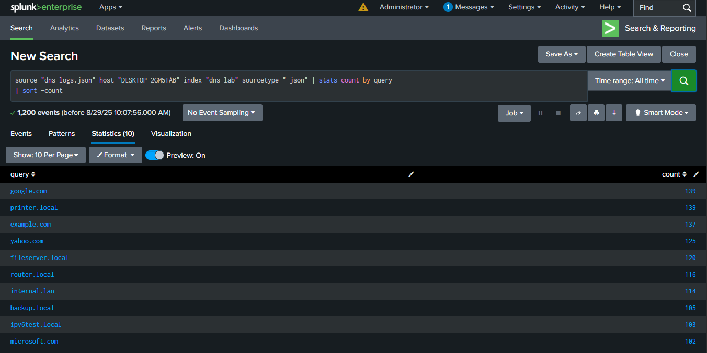
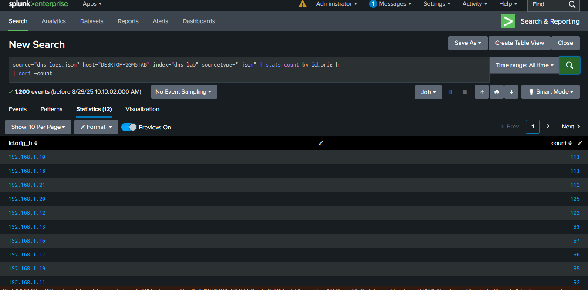
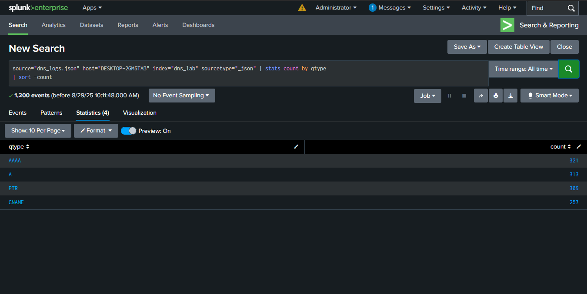

# Splunk DNS Log Analysis Project

## Project Description
This project demonstrates the analysis of DNS logs using Splunk. The goal is to practice SOC analyst skills by:
- Identifying the most frequently queried domain names.
- Finding the most active user IPs generating DNS traffic.
- Breaking down DNS query types (A, AAAA, CNAME, PTR).

## Tasks Performed
### Task 1: Most Frequently Queried Domain Names
- **Query Used**: `index=dns_lab sourcetype=json | stats count by query | sort -count`
- **Screenshot**: 

### Task 2: Most Active User IPs
- **Query Used**: `index=dns_lab sourcetype=json | stats count by id.orig_h | sort -count`
- **Screenshot**: 

### Task 3: Breakdown of DNS Query Types
- **Query Used**: `index=dns_lab sourcetype=json | stats count by qtype`
- **Screenshot**: 

## How to Use
1. Upload the `dns_log.json` file to Splunk Cloud with index "dns_lab" and source type "json".
2. Run the provided SPL queries in the "Search & Reporting" section.
3. View results and refer to screenshots for expected output.

## Files Included
- `dns_log.json`: Sample DNS log file in JSON format.
Screenshots: `DNS LOG SPLUNK TASK 1.png`, `DNS LOG SPLUNK TASK 2.png`, `DNS LOG SPLUNK TASK 3.png` (stored in repository root).

## Notes
This project was created as part of a learning journey to become a SOC analyst. All tasks were performed using Splunk.
